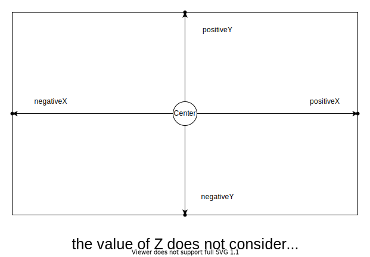

# plyファイルのエラー点を除去する

LiDARで点群を計測すると計測できなかったエラー点が残るため、除去する。

プロパティの個数 9個のplyファイルで
半径3.0m以内の点を残す場合は、
```
./preproces --in "ply_file.ply" --property_num 9 --radius 3.0
```


NOTE: windowsで動かすと 改行が悪さしてるぽいので、改行コードを置換する処理が必要。
```bash
sed -i 's/\r//' *.sh
```


## option
- -h, --help  
- -i, --file [ARG]  
input filenameを指定。
- -o, --out [ARG]  
output filenameを指定。デフォルトはoutput.ply
- -p, --property_num [ARG]  
plyファイルのオプションの数を指定。デフォルトは4
plyファイルのheaderにあるpropertyの個数を指定
```
ply  
format ascii 1.0  
comment ViewPLUS PointType : struct vp::PointXYZITRGBA  
element vertex 381571  
property float x  
property float y  
property float z  
property float intensity  
property double time_stamp  
property uchar blue  
property uchar green  
property uchar red  
property uchar alpha  
end_header
```

- -ra, --radius [ARG]  
 原点からのxy半径を指定する。  
 各点のユークリッド距離を計算して、設定した値以上の点を除去する。
 x,yの値からしか距離計算をしておらず、z(高さ)は考慮していない。

- -re, --rectangle [ARG1] [ARG2] [ARG3] [ARG4]  
原点からの矩形範囲を指定する。  
arg1 = xのプラス範囲  
arg2 = xのマイナス範囲  
arg3 = yのプラス範囲  
arg4 = yのマイナス範囲  


